# GradeA+GS

## **Summary**
Novel view synthesis from unconstrained images with Deformable 3D Gaussian Splatting

## **Style Result Examples**
Reference image |  Trevi-fountain  |  Brandenburg-gate  |  Scare-Coeur
:-------------------------:|:-------------------------:|:-------------------------:|:-------------------------:
Blank |  |  | 
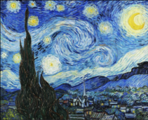 | 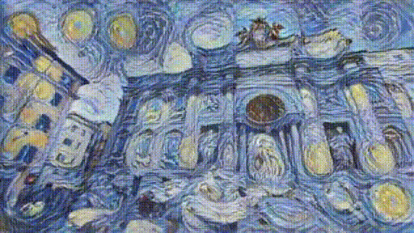 |  | 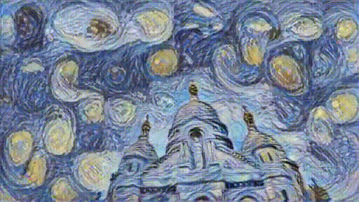
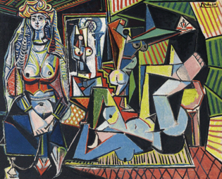 | 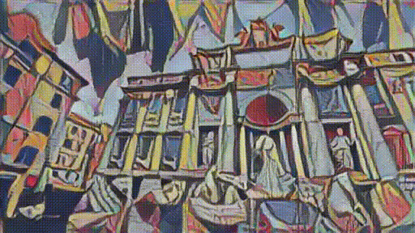 |  | 
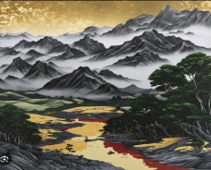 | 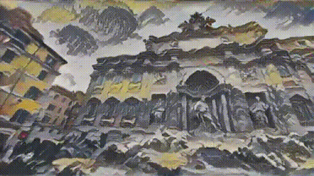 |  | 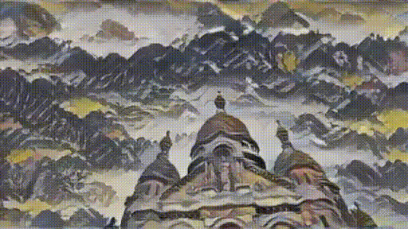

## **Experiment Result**
Blank | PSNR | SSIM | LPIPS
:-------------------------:|:-------------------------:|:-------------------------:|:-------------------------:
Existing Methods | 30.06 | 0.946 | 0.114
W/O Diffusion | 30.13 | 0.944 | 0.112
W/O VGG | 29.33 | blank | blank
W/O LischipzMLP | 29.76 | 0.927 | 0.145
Full | 30.73 | 0.942 | 0.116

| Dataset| Brandenburg Gate | Trevi Fountain | Sacre Coeur |
| ----- | ----- | ---- | ---- |
| Method | PSNR & SSIM & LPIPS | PSNR & SSIM & LPIPS  | PSNR & SSIM & LPIPS |
NeRF          | 18.90 & 0.815 & 0.231 | 15.60 & 0.715 & 0.291 | 16.14 & 0.600 & 0.366 |
NeRF-W        | 24.17 & 0.870 & 0.156 | 18.97 & 0.698 & 0.265 | 19.20 & 0.807 & 0.191 |
Ha-NeRF       | 24.04 & 0.877 & 0.139 | 20.18 & 0.690 & 0.222 | 20.02 & 0.801 & 0.171 |
CR-NeRF       | 26.53 & 0.880 & 0.106 | 21.48 & 0.768 & 0.206 | 22.00 & 0.834 & 0.152 |
RefinedFields | 26.64 & 0.886 & 0.118 | 23.42 & 0.802 & 0.214 | 22.26 & 0.872 & 0.186 |
3DGS          | 19.90 & 0.889 & 0.180 | 18.47 & 0.761 & 0.234 | 17.57 & 0.677 & 0.264 |
SWAG          | 26.33 & 0.929 & 0.119 | 23.10 & 0.815 & 0.208 | 22.68 & 0.862 & 0.150 |
GS-W          | 27.96 & 0.932 & 0.086 | 22.91 & 0.801 & 0.156 | 23.24 & 0.863 & 0.130 |
Splatfacto-W      | 26.87 & 0.932 & 0.124 | 22.66 & 0.769 & 0.224 | 22.53 & 0.836 & 0.187 |
Splatfacto-W-A    | 27.50 & 0.930 & 0.110 | 23.10 & 0.810 & 0.195 | 22.62 & 0.876 & 0.152 |
K-Planes          |25.49 & 0.879 & 0.224| 22.67 & 0.714 & 0.317| 0.224 & 20.61 & 0.774 |
Wild-GS | 27.77 & 0.927 & 0.133 | 23.63 & 0.766 & 0.228 |22.56 & 0.859 & 0.177 |
GradeA+GS (Ours) | 28.04 & 0.931 & 0.124 | 23.69 & 0.764 & 0.217 | 22.72 & 0.863 & 0.165 |

## **3D Result Examples**
Scare-Coeur | QR
:-------------------------:|:-------------------------:
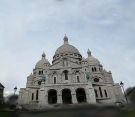 | 
Trevi-Fountain | QR
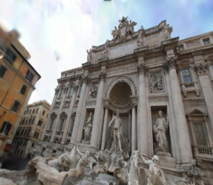 | 
Brandenburg-Gate | QR
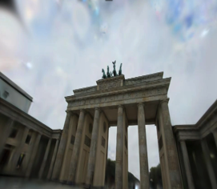 | 
Park | QR
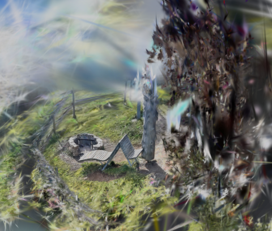 | 

## Acknowledgement
This repository is built on top of [WildGaussian](https://github.com/jkulhanek/wild-gaussians) and [SDXL](https://stablediffusionxl.com/) repositories. We would like to thank for their incredible works ❤.