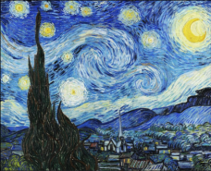
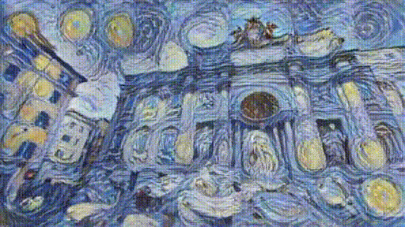
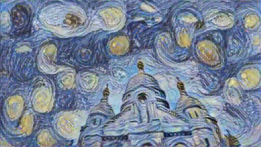
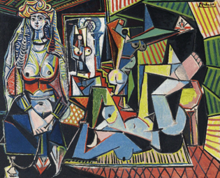
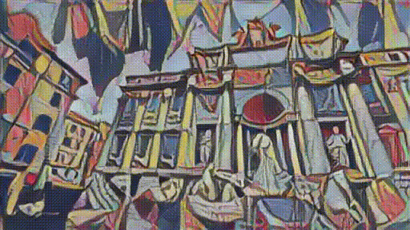
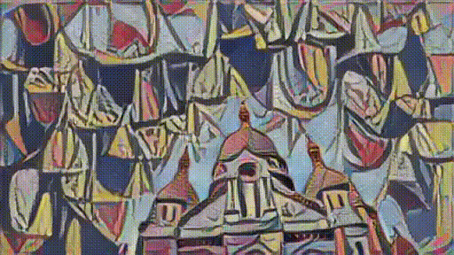
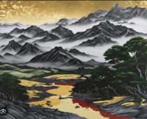
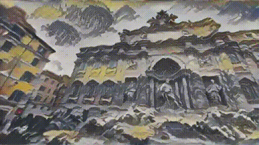
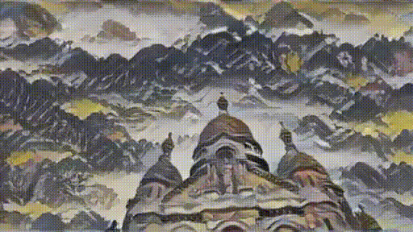

# GradeA+GS

## **Summary**
Novel view synthesis from unconstrained images with Deformable 3D Gaussian Splatting

## **Result Examples**
Reference image|  Trevi-fountain  |  Brandenburg-gate  |  Scare-Coeur
:-------------------------:|:-------------------------:|:-------------------------:|:-------------------------:
Blank |  |  | 
 |  |  | 
 |  |  | 
 |  |  | 

## **Experiment Result**
